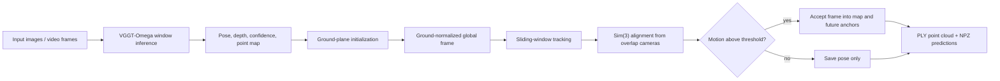
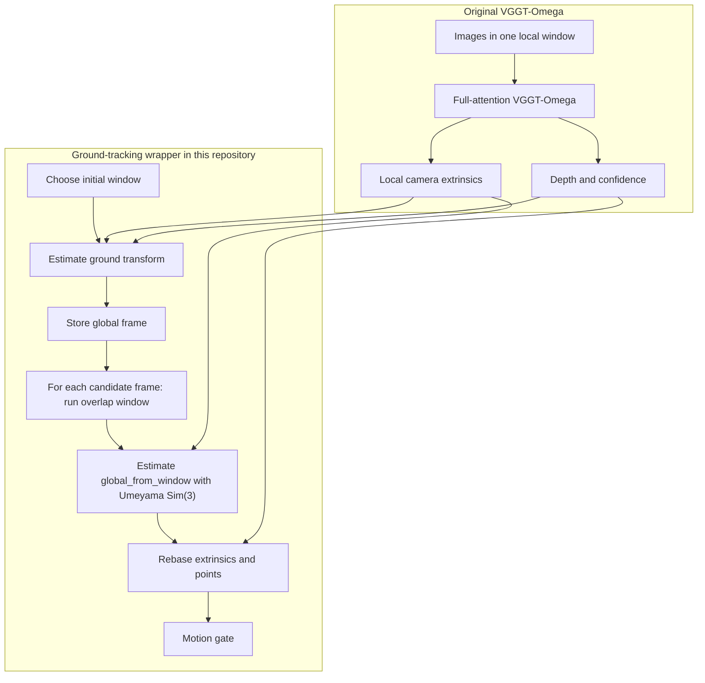
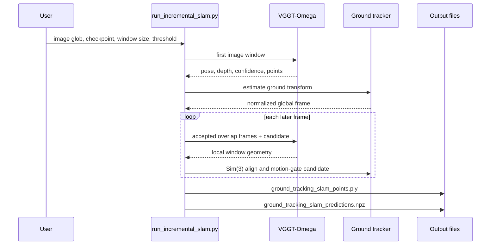

# VGGT-Omega SLAM with Ground-Tracking

This project is an experimental SLAM-style inference pipeline built on top of
[VGGT-Omega](https://github.com/facebookresearch/vggt-omega). The original
VGGT-Omega model remains the geometry engine: it predicts camera pose, depth,
confidence, and point maps for a short ordered image sequence. This repository
wraps that model with a ground-normalized sliding-window tracker so longer
videos can be processed in one consistent, interpretable coordinate frame.

The current public runner is `scripts/run_incremental_slam.py`. Despite the
historical filename, the supported mode is now ground-tracking sliding-window
SLAM. The older append-only KV-cache mode and the plain sliding-window mode were
removed from the command-line interface to avoid maintaining several coordinate
systems at once.

## What Changed From VGGT-Omega

VGGT-Omega is normally a batch model: it receives a set or short sequence of
images and predicts geometry in that sequence's local coordinate system. Each
new window can have a different origin, orientation, and scale. This project
does not retrain the released checkpoint. Instead, it changes the inference
system around VGGT-Omega:

- run VGGT-Omega repeatedly on overlapping windows;
- estimate a ground plane from the first window;
- rotate the first window so the estimated ground normal becomes global up;
- scale the scene so the first camera-to-ground distance is `1`;
- align later windows into that global frame with Sim(3);
- add only sufficiently translated frames to the map and to the future window
  anchor set.



## Model Adaptation

The model itself is still `VGGTOmega`. The adaptation is a tracking wrapper,
not a learned recurrent model:



Important consequences:

- The released VGGT-Omega checkpoint can be used directly.
- There is no learned temporal state, bundle adjustment, loop closure, or pose
  graph optimization.
- The output coordinate system is defined by the first window's estimated
  ground plane, not by GPS, IMU, COLMAP, or a metric calibration target.

## How Ground Is Estimated

The first VGGT-Omega window initializes the global coordinate frame. The code
uses the first frame's predicted point map and confidence map:

1. Select candidate ground points:
   - keep finite points only;
   - prefer points in the lower part of the image;
   - prefer points with confidence at or above the median confidence;
   - prefer points whose model-space vertical coordinate suggests they are
     below the camera.
2. Fit a coarse plane with SVD over those candidates.
3. Compute the coarse camera-to-plane distance `d`.
4. Run deterministic RANSAC with threshold `max(d / 10, 1e-4)`.
5. Refit the plane with SVD on the RANSAC inliers.
6. Orient the normal so it points upward relative to the candidate centroid.
7. Rotate that normal onto the global up axis `[0, 1, 0]`.
8. Scale the scene by `1 / d`, so the first camera is one normalized unit above
   the estimated ground plane.

The initial ground transform is therefore:

```text
global_point = scale * R_ground * local_point
scale = 1 / camera_to_ground_distance
R_ground * ground_normal = [0, 1, 0]
```

This gives the tracker a practical normalized unit. With the default motion
threshold of `0.1`, a frame is accepted after moving roughly one tenth of the
first camera height above the estimated ground.

## Window Alignment

After initialization, each tracking step builds a window from the latest
accepted frames plus one candidate frame:

```text
accepted anchors: 0 1 2 3
candidate:        4
window:           0 1 2 3 4
```

If frame `4` is accepted, it becomes a future anchor. If it is rejected, it
still receives a global pose, but it is not added to the map and it is not used
as a future alignment anchor.

Every new window has its own VGGT-Omega local coordinates. The overlap cameras
are used to estimate a similarity transform:

```text
p_global ~= s * R * p_window + t
global_from_window = [sR, t]
```

The implementation uses Umeyama alignment on overlapping camera centers. The
same Sim(3) is then applied to:

- predicted point maps;
- camera-from-world extrinsics;
- regenerated `pose_enc` values.

This keeps `extrinsic`, `pose_enc`, and `world_points_from_depth` in the same
ground-normalized global frame.

## Runtime Flow



## Running

Example:

```bash
python scripts/run_incremental_slam.py \
  'outputs/dji_0005_10s_2fps/frames/*.jpeg' \
  --checkpoint checkpoints/VGGT-Omega-1B-512/model.pt \
  --output-dir outputs/dji_0005_10s_2fps/ground_tracking_w5_thresh0p1 \
  --window-size 5 \
  --displacement-threshold 0.1 \
  --image-resolution 512 \
  --max-points 300000 \
  --conf-percentile 20
```

Common options:

| Option | Meaning |
| :--- | :--- |
| `--checkpoint` | Path to the released VGGT-Omega checkpoint. |
| `--window-size` | Number of frames per VGGT-Omega tracking window. The candidate frame is appended after the latest accepted anchors. |
| `--displacement-threshold` | Minimum normalized translation required before a candidate is accepted into the map and future anchor set. |
| `--image-resolution` | Preprocessing resolution passed to VGGT-Omega. Use `512` for the `VGGT-Omega-1B-512` checkpoint. |
| `--conf-percentile` | Confidence percentile used when exporting the point cloud. |
| `--max-points` | Maximum number of exported PLY points after filtering. |
| `--device` | `cuda` or `cpu`. CUDA is expected for practical runs. |

Outputs:

- `ground_tracking_slam_points.ply`: filtered colored point cloud containing
  accepted map frames.
- `ground_tracking_slam_predictions.npz`: poses and diagnostics for all input
  frames.

The `.npz` file contains:

| Key | Description |
| :--- | :--- |
| `pose_enc` | Global pose encoding for every input frame. |
| `extrinsic` | Ground-normalized camera-from-world extrinsics for every frame. |
| `intrinsic` | Predicted intrinsics for every frame. |
| `image_paths` | Input image paths after glob expansion. |
| `accepted_mask` | Boolean mask showing which frames entered the map and future anchor set. |
| `accepted_indices` | Integer indices of accepted frames. |
| `displacements` | Candidate displacement from the latest accepted frame. |
| `ground_transform` | Initial Sim(3)-style ground normalization transform. |
| `ground_plane` | Estimated first-frame ground plane. |
| `ground_inliers` | Number of RANSAC inliers for the ground plane. |
| `ground_ransac_threshold` | RANSAC plane threshold derived from coarse distance. |
| `ground_coarse_distance` | Coarse camera-to-plane distance before RANSAC refinement. |
| `global_from_window` | Per-window transforms into the global frame. |

## Docker Checkpoints

The Dockerfile downloads both released checkpoints during build using a BuildKit
secret named `hf_token`:

- `/app/checkpoints/VGGT-Omega-1B-512/model.pt`
- `/app/checkpoints/VGGT-Omega-1B-256-Text-Alignment/model.pt`

Build example:

```bash
printf '%s' "$HF_TOKEN" > /tmp/vggt_omega_hf_token
DOCKER_BUILDKIT=1 docker build \
  --secret id=hf_token,src=/tmp/vggt_omega_hf_token \
  -t vggt-omega:local .
rm -f /tmp/vggt_omega_hf_token
```

Run example:

```bash
docker run --rm --gpus all --ipc=host \
  -v /home/ubuntu/resplat/users/familyroom0526:/data/familyroom0526:ro \
  -v /home/ubuntu/vggt-omega/outputs:/outputs \
  vggt-omega:local \
  python scripts/run_incremental_slam.py \
    '/data/familyroom0526/*.jpeg' \
    --checkpoint /app/checkpoints/VGGT-Omega-1B-512/model.pt \
    --output-dir /outputs/familyroom_ground_tracking \
    --window-size 5 \
    --displacement-threshold 0.1 \
    --image-resolution 512
```

Do not hard-code a Hugging Face token into the Dockerfile. Use the secret mount
so the token is available only during the build step.

## Current Limitations

- Ground estimation is heuristic. It assumes the first view contains enough
  visible ground below the camera.
- The global up direction and normalized scale come from the first fitted plane.
  A bad first plane will affect the whole track.
- Sim(3) is estimated only from overlapping camera centers. Nearly pure rotation
  or tiny baselines can still be unstable.
- Rejected frames still have pose output, but their points are not added to the
  exported map.
- There is no loop closure, bundle adjustment, dense fusion, or global pose
  graph optimization.
- The tracker uses the released full-attention VGGT-Omega checkpoint directly.
  It is not a trained recurrent, causal, or metric SLAM system.

## Verification

Run the focused SLAM API tests:

```bash
python -m pytest -q tests/test_incremental_slam_api.py
```

The tests include point-map convention checks and Sim(3) recovery checks for
scale, rotation, and translation.
