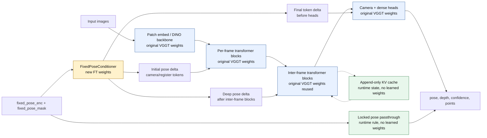
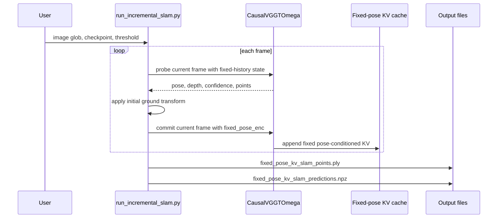

# VGGT-Omega SLAM Experiments

This repository is an experimental SLAM-style inference workspace built on top of
[VGGT-Omega](https://github.com/facebookresearch/vggt-omega). It now keeps the
old sliding-window tracker and the new fixed-pose KV-cache tracker as separate
scripts so they can be compared directly.

| Script | Purpose |
| :--- | :--- |
| `scripts/run_incremental_slam.py` | Legacy ground-normalized sliding-window runner. It repeatedly runs full `VGGTOmega` windows and aligns each window with Sim(3). |
| `scripts/run_fixed_pose_kv_slam.py` | New append-only fixed-pose KV-cache runner using `CausalVGGTOmega`. Historical poses are committed as locked anchors. |
| `scripts/compare_slam_modes.py` | Runs full VGGT-Omega, legacy sliding-window, and fixed-pose KV SLAM, then plots trajectories and ATE against full VGGT-Omega. |
| `scripts/train_fixed_pose_student.py` | Fine-tunes the fixed-pose student from full VGGT-Omega teacher outputs. |

## Main Improvements over VGGT-Omega

Original VGGT-Omega is a full-sequence predictor: it receives a short image set
and jointly predicts pose, depth, and points for every frame in that set. That is
strong for local geometry, but it is not a SLAM interface because historical
poses can be re-predicted and drift when a new frame arrives.

This repo adds a fixed-pose incremental path:

```text
new image + fixed pose-conditioned history KV cache
    -> current-frame prediction
    -> commit current pose as a fixed anchor
    -> append fixed pose-conditioned tokens to KV cache
```

Key changes:

- **Sliding-window frame processing**: the legacy runner supports frame-by-frame inference over long sequences with a sliding window, keeping an incremental baseline that does not require running the full sequence at once.
- **Fixed pose conditioning**: known poses are encoded and injected into camera/register tokens before the causal transformer path, so cached history tokens can represent registered SLAM anchors.
- **Frozen input poses**: when a frame is marked fixed, its input pose is passed through unchanged in `predictions["pose_enc"]`; the raw camera-head output remains available as `predictions["pose_enc_model"]`.
- **KV-cache reuse**: committed history frames and poses stay in the causal inter-frame KV cache, so later frames query registered memory instead of recomputing already-processed frames or poses.
- **Teacher-student distilled fixed-pose model**: the fixed-pose student has been re-trained from full VGGT-Omega teacher outputs so the network parameters can use frozen input poses as SLAM/global anchors.
- **No per-window scale**: the runner applies one initial ground normalization transform and then keeps appending fixed-pose frames. There is no `global_from_window` output and no window alignment scale to monitor.
- **Checkpoint compatibility**: original encoder, transformer, and head weights are reused with `strict=False`; the fixed-pose adapter can still start as a no-op when loading the base checkpoint.
- **Native macOS path planned**: native Mac execution without CUDA-only dependencies is on the roadmap.

## Incremental Model Structure and Weights

`CausalVGGTOmega` keeps the original VGGT-Omega image encoder, alternating
attention blocks, camera head, and dense head. The incremental path changes how
the inter-frame blocks are called: they run with frame-causal attention and an
append-only KV cache instead of recomputing a full sequence window. The cache,
fixed-pose passthrough, and SLAM state are runtime structure; they do not add
learned parameters.

When fine-tuning with `--freeze-backbone`, the only trainable module is
`aggregator.fixed_pose_conditioner`. It is a zero-initialized
fixed-pose adapter that injects known 9D `fixed_pose_enc` values into locked
history frames at three points: the initial camera/register tokens, the
camera/register tokens after each inter-frame block, and the cached final
camera/register tokens consumed by the camera and dense heads. All original
VGGT-Omega backbone and head weights remain frozen.



| Component | Source of weights | Fine-tuned by default? |
| :--- | :--- | :--- |
| Patch embed / DINO backbone | Original VGGT-Omega checkpoint | No |
| Frame attention blocks | Original VGGT-Omega checkpoint | No |
| Inter-frame attention blocks | Original VGGT-Omega checkpoint, called through causal KV-cache adapters | No |
| Camera token and register tokens | Original VGGT-Omega checkpoint | No |
| Camera head | Original VGGT-Omega checkpoint | No |
| Dense/depth head | Original VGGT-Omega checkpoint | No |
| `aggregator.fixed_pose_conditioner` | New zero-initialized adapter | Yes, when `--freeze-backbone` is enabled |
| KV cache, SLAM state, fixed-pose passthrough | Runtime state/rules, not parameters | No |

Minimal model API example:

```python
import torch
from vggt_omega.models import CausalVGGTOmega

model = CausalVGGTOmega().eval()
state = model.init_slam_state()
images = torch.rand(1, 2, 3, 512, 512)
fixed_pose_enc = torch.zeros(1, 2, 9)
fixed_pose_mask = torch.tensor([[True, False]])

with torch.inference_mode():
    predictions, state = model.forward_incremental(
        images,
        state,
        fixed_pose_enc=fixed_pose_enc,
        fixed_pose_mask=fixed_pose_mask,
    )

assert torch.equal(predictions["fixed_pose_mask"], fixed_pose_mask)
assert torch.allclose(predictions["pose_enc"][:, 0], fixed_pose_enc[:, 0])
```

## Runtime Flow

The runner uses a two-pass step for each frame:

1. **Probe** the new frame against the current fixed-history KV cache and predict
   its pose/depth.
2. **Commit** the same frame back into the KV cache with `fixed_pose_mask=True`
   and the predicted pose as `fixed_pose_enc`.

The probe state is discarded, so unconditioned current-frame tokens are not
written into memory. The committed state is the only persistent SLAM memory.



## Ground Normalization

The first frame initializes a single global coordinate transform. The runner
estimates a ground plane from the first predicted point map and confidence map,
rotates the plane normal to global up `[0, 1, 0]`, and scales the first
camera-to-ground distance to `1`.

The same transform is applied to all later poses and points. Unlike the old
sliding-window tracker, later frames do not get their own Sim(3) alignment.

## Running

Run the legacy sliding-window baseline:

```bash
python scripts/run_incremental_slam.py \
  'outputs/dji_0005_10s_2fps/frames/*.jpeg' \
  --checkpoint checkpoints/VGGT-Omega-1B-512/model.pt \
  --output-dir outputs/dji_0005_10s_2fps/sliding_window \
  --window-size 5 \
  --displacement-threshold 0.1 \
  --image-resolution 512
```

Run the new fixed-pose KV-cache tracker:

```bash
python scripts/run_fixed_pose_kv_slam.py \
  'outputs/dji_0005_10s_2fps/frames/*.jpeg' \
  --checkpoint checkpoints/VGGT-Omega-1B-512/model.pt \
  --output-dir outputs/dji_0005_10s_2fps/fixed_pose_kv \
  --displacement-threshold 0.1 \
  --image-resolution 512 \
  --max-points 300000 \
  --conf-percentile 20
```

Compare full VGGT-Omega, old sliding-window, and fixed-pose KV SLAM:

```bash
python scripts/compare_slam_modes.py \
  'outputs/dji_0005_10s_2fps/frames/*.jpeg' \
  --checkpoint checkpoints/VGGT-Omega-1B-512/model.pt \
  --output-dir outputs/dji_0005_10s_2fps/comparison \
  --image-resolution 512 \
  --window-size 5
```

Common options:

| Option | Meaning |
| :--- | :--- |
| `--checkpoint` | Path to the released VGGT-Omega checkpoint. |
| `--displacement-threshold` | Minimum normalized translation required before adding a frame's points to the exported map. Poses are still locked for every frame. |
| `--image-resolution` | Preprocessing resolution passed to VGGT-Omega. Use `512` for the `VGGT-Omega-1B-512` checkpoint. |
| `--conf-percentile` | Confidence percentile used when exporting the point cloud. |
| `--max-points` | Maximum number of exported PLY points after filtering. |
| `--device` | `cuda` or `cpu`. CUDA is still recommended for practical runs today; native macOS execution without CUDA-only dependencies is planned. |
| `--window-size` | Used by the legacy sliding-window runner and comparison script. Ignored by `run_fixed_pose_kv_slam.py`. |

Outputs:

- `fixed_pose_kv_slam_points.ply`: filtered colored point cloud from accepted
  map frames.
- `fixed_pose_kv_slam_predictions.npz`: poses and diagnostics for all input
  frames.

The `.npz` file contains:

| Key | Description |
| :--- | :--- |
| `pose_enc` | Ground-normalized pose encoding for every input frame. |
| `pose_enc_model` | Model-gauge pose encoding for every input frame, used for fixed-pose history conditioning before ground normalization. |
| `extrinsic` | Ground-normalized camera-from-world extrinsics for every frame. |
| `intrinsic` | Predicted intrinsics for every frame. |
| `image_paths` | Input image paths after glob expansion. |
| `accepted_mask` | Boolean mask showing which frames contributed points to the exported map. |
| `accepted_indices` | Integer indices of point-map accepted frames. |
| `displacements` | Frame displacement from the latest point-map accepted frame. |
| `locked_pose_mask` | Boolean mask showing which frames were committed as fixed pose anchors. |
| `ground_transform` | Initial single ground normalization transform. |
| `ground_plane` | Estimated first-frame ground plane. |
| `ground_inliers` | Number of RANSAC inliers for the ground plane. |
| `ground_ransac_threshold` | RANSAC plane threshold derived from coarse distance. |
| `ground_coarse_distance` | Coarse camera-to-plane distance before RANSAC refinement. |
| `kv_cache_tokens` | Number of cached tokens in the first cached inter-frame layer. |

## Fine-Tuning Fixed-Pose KV SLAM

`scripts/train_fixed_pose_student.py` is the repeatable fine-tuning entry point
for the fixed-pose path. The current preferred recipe is **curriculum
distillation from full-window teacher cache**:

```text
100-frame teacher window -> reusable teacher_pose + teacher_camera_and_register_tokens
2-frame virtual clip     -> 1 fixed history frame + 1 supervised target
3-frame virtual clip     -> 2 fixed history frames + 1 supervised target
4-frame virtual clip     -> 3 fixed history frames + 1 supervised target
5-frame virtual clip     -> 4 fixed history frames + 1 supervised target
```

Small training clips should not get their own first-frame-origin VGGT coordinate
system. Subclips cut from a 100-frame teacher window reuse that full-window
teacher coordinate frame, so the first frame of a subclip is often not canonical.
The model therefore learns that `fixed_pose_enc` is an input model-gauge SLAM
anchor, not merely VGGT's default first-frame local convention.

When `--freeze-backbone` is enabled, the frozen VGGT-Omega backbone stays in
`eval()` mode and only `aggregator.fixed_pose_conditioner` is in `train()` mode.
Training supervises `pose_enc_model` on fixed history frames before pass-through
replacement, so the camera head learns the locked poses instead of only the
public `pose_enc` API being overwritten. Token distillation also supervises final
camera/register tokens when the cache contains
`teacher_camera_and_register_tokens`.

The public-data curriculum recipe uses TUM RGB-D, EuRoC/ETH cam0, and MIT JPEG
frame directories under `/app/public_data`, then trains sequential stages
`1+1 -> 2+1 -> 3+1 -> 4+1`. `scripts/train_fixed_pose_public_only.sh` records the
same paths and defaults:

```text
SUBCLIP_LENGTHS=2 3 4 5
CURRICULUM_CLIP_LENGTHS=2 3 4 5
BATCH_SIZE=3
LR=8e-6
TOKEN_WEIGHT=0.1
WANDB=1
```

Set environment variables to override the defaults, for example:

```bash
WANDB=0 LR=3e-6 EPOCHS=1 \
docker compose run --rm vggt-omega \
  bash scripts/train_fixed_pose_public_only.sh
```

The curriculum cache paths used by the script are:

```text
/app/outputs/teacher_cache/cache_public_rgb_w100_windows_sub2_3_4_5_tokens
/app/outputs/teacher_cache/cache_eth_cam0_w100_windows_sub2_3_4_5_tokens
/app/outputs/teacher_cache/cache_mit_jpg_w100_windows_sub2_3_4_5_tokens
```

If those full-window caches do not exist yet, they can be prepared directly from
frame directories or converted from existing 5-frame teacher-token caches:

```text
/app/outputs/teacher_cache/cache_public_rgb_w100_sub5_tokens
/app/outputs/teacher_cache/cache_eth_cam0_w100_sub5_tokens
/app/outputs/teacher_cache/cache_mit_jpg_w100_sub5_tokens
```

To prepare a full-window cache directly from frame directories instead of
converting an existing cache, run `--prepare-global-window-cache` with
`--cache-full-windows` and the curriculum subclip lengths:

```bash
docker compose run --rm vggt-omega \
  python scripts/train_fixed_pose_student.py \
    /app/public_data/tum/rgbd_dataset_freiburg2_pioneer_360/rgb \
    /app/public_data/tum/rgbd_dataset_freiburg2_pioneer_slam/rgb \
    /app/public_data/tum/rgbd_dataset_freiburg2_pioneer_slam2/rgb \
    /app/public_data/tum/rgbd_dataset_freiburg2_pioneer_slam3/rgb \
    --teacher-checkpoint /app/checkpoints/VGGT-Omega-1B-512/model.pt \
    --output /tmp/vggt_fixed_pose_ft/checkpoints/cache_prepare_dummy.pt \
    --teacher-cache-dir /app/outputs/teacher_cache/cache_public_rgb_w100_windows_sub2_3_4_5_tokens \
    --prepare-global-window-cache \
    --cache-only \
    --image-resolution 512 \
    --teacher-window-length 100 \
    --subclip-lengths 2 3 4 5 \
    --subclip-stride 1 \
    --cache-full-windows \
    --cache-teacher-tokens
```

Manual training over prepared curriculum caches looks like:

```bash
docker compose run --rm vggt-omega \
  python scripts/train_fixed_pose_student.py \
    /app/public_data/tum/rgbd_dataset_freiburg2_pioneer_360/rgb \
    /app/public_data/tum/rgbd_dataset_freiburg2_pioneer_slam/rgb \
    /app/public_data/tum/rgbd_dataset_freiburg2_pioneer_slam2/rgb \
    /app/public_data/tum/rgbd_dataset_freiburg2_pioneer_slam3/rgb \
    /app/public_data/eth/machine_hall/MH_01_easy/mav0/cam0/data \
    /app/public_data/eth/machine_hall/MH_02_easy/mav0/cam0/data \
    /app/public_data/eth/machine_hall/MH_03_medium/mav0/cam0/data \
    /app/public_data/eth/machine_hall/MH_04_difficult/mav0/cam0/data \
    /app/public_data/eth/machine_hall/MH_05_difficult/mav0/cam0/data \
    /app/public_data/mit/office \
    /app/public_data/mit/apartment/images \
    /app/public_data/mit/building/images \
    --teacher-checkpoint /app/checkpoints/VGGT-Omega-1B-512/model.pt \
    --output /tmp/vggt_fixed_pose_ft/checkpoints/fixed_pose_student_tum_eth_mit_curriculum_epoch1.pt \
    --profile-output /tmp/vggt_fixed_pose_ft/profile_tum_eth_mit_curriculum_epoch1.json \
    --teacher-cache-dir /app/outputs/teacher_cache/cache_public_rgb_w100_windows_sub2_3_4_5_tokens \
    --teacher-cache-dir /app/outputs/teacher_cache/cache_eth_cam0_w100_windows_sub2_3_4_5_tokens \
    --teacher-cache-dir /app/outputs/teacher_cache/cache_mit_jpg_w100_windows_sub2_3_4_5_tokens \
    --image-resolution 512 \
    --epochs 1 \
    --batch-size 3 \
    --lr 8e-6 \
    --curriculum-clip-lengths 2 3 4 5 \
    --token-weight 0.1 \
    --fixed-token-weight 1.0 \
    --target-token-weight 1.0 \
    --fixed-raw-pose-weight 1.0 \
    --freeze-backbone
```

`--batch-size` is implemented as gradient accumulation because the first
fixed-pose SLAM state is batch-size 1 internally. The fixed-pose SLAM runner
commits locked poses in the model's native gauge, then exports a separately
ground-normalized trajectory in `pose_enc` and `extrinsic`; this keeps
fixed-pose conditioning aligned with training while preserving useful map and
trajectory outputs.

## Docker Compose

The Dockerfile builds the dependency/runtime image only. Repository code is not
baked into the image; `docker-compose.yml` bind-mounts the host checkout into
`/app` so code changes are picked up dynamically. The compose service also
mounts the host `/tmp` into the container `/tmp`.

By default, compose uses checkpoints from the mounted host checkout:

- `/app/checkpoints/VGGT-Omega-1B-512/model.pt`
- `/app/checkpoints/VGGT-Omega-1B-256-Text-Alignment/model.pt`

Build and run the demo with compose:

```bash
docker compose build vggt-omega
docker compose up vggt-omega
```

Run the SLAM script through the same service:

```bash
docker compose run --rm vggt-omega \
  python scripts/run_fixed_pose_kv_slam.py \
    '/tmp/frames/*.jpeg' \
    --checkpoint /app/checkpoints/VGGT-Omega-1B-512/model.pt \
    --output-dir /tmp/vggt_omega_slam \
    --displacement-threshold 0.1 \
    --image-resolution 512
```

Set `VGGT_OMEGA_PORT` to change the exposed Gradio port. Do not hard-code a
Hugging Face token into the Dockerfile; use a BuildKit secret only when
intentionally baking checkpoints into the image.

## Current Limitations

- Native macOS execution is still a TODO; practical runs currently prefer CUDA-capable hardware.
- The runner is append-only. It does not perform loop closure, bundle
  adjustment, dense fusion, or global pose-graph optimization.
- Ground estimation is heuristic and depends on the first frame containing
  enough visible ground below the camera.
- Rejected map frames still have locked poses, but their points are not added to
  the exported point cloud.

## Verification

Run the focused SLAM API tests:

```bash
python -m pytest -q tests/test_incremental_slam_api.py
```

The tests include fixed-pose passthrough, KV-cache growth, point-map convention,
and Sim(3) utility checks.
